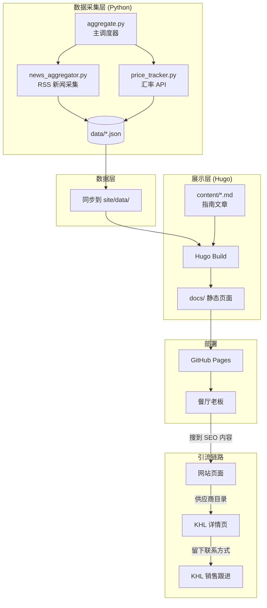

# ARCHITECTURE.md

## 系统拓扑



## 数据流向

```
RSS 源 / 汇率 API
    ↓ (每 12h GitHub Actions)
Python 采集 → data/*.json
    ↓ (同步)
site/data/*.json → Hugo 读取 → 静态页面
    ↓ (自动部署)
GitHub Pages → 用户浏览器
```

## 模块依赖

```
aggregate.py  ← 依赖 ← news_aggregator.py
aggregate.py  ← 依赖 ← price_tracker.py
Hugo layouts   ← 读取 ← site/data/*.json （运行时）
```

无循环依赖。所有数据单向流动。
