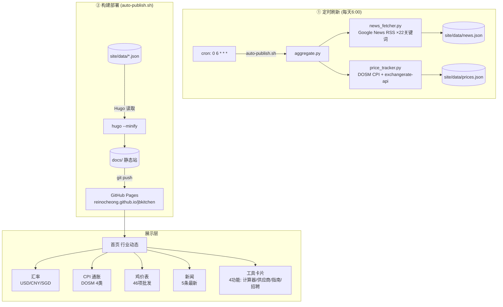

# ARCHITECTURE.md — 系统架构与工作流手册

> **开发信条：** 厨师简历栏 = 免费招聘栏位 → 吸引厨师注册 → 拿到线索 → KHL 销售谈供应。
> KHL 不介入安排厨师工作，不做中介。所有开发决策以此为准。

---

## 一、完整数据流（两路并行）



## 二、每次操作什么时间点做什么

### 日常运行（自动）

|| 时间 | 动作 | 触发 | 数据源 | 影响 |
||:---|:---|:---|:---|:---|
|| 6:00 | `auto-publish.sh` 执行 | cron `5c97932548d0` | 新闻RSS · DOSM CPI · 汇率API · 5大招聘网站 | 网站自动更新 |
|| DOSM 发布新月度 CPI | `price_tracker.py` 下次运行时 | DOSM API (cpi_headline) | 通胀数据月度更新 |

### 故障排查（人工）

> **第一步永远先跑 `./scripts/auto-publish.sh`** — 这步会刷新所有数据并部署，能解决90%的「数据不更新」问题。

|| 数据不更新 | 手动跑 `bash scripts/auto-publish.sh` | 一行命令刷新所有数据 + 部署 |
|| 汇率/CPI 不动 | `python3 -c "import json; print(json.load(open('site/data/prices.json'))['updated'])"` | 手动跑 `python3 scripts/price_tracker.py` |
|| 新闻没更新 | `python3 -c "import json; d=json.load(open('site/data/news.json')); print(len(d['items']), 'articles')"` | 手动跑 `python3 scripts/news_fetcher.py` |
|| 网站白屏/样式没了 | `curl -s https://reinocheong.github.io/jbkitchen/index.html \| head -5` | 检查 `.nojekyll` 文件是否存在、路径是否 `absURL`、?v3 版本号 |
|| CSS 样式不对 | 查看浏览器 Console 的 404 错误 | 确认 CSS 链接加了 ?v3 版本号（GitHub Pages CDN 缓存） |
|| 整个网站404 | `curl -sI https://reinocheong.github.io/jbkitchen/` | 检查 GitHub Pages 是否开启、docs/ 目录是否存在 |

### Daemon 相关操作

> WhatsApp Channel 鸡价已改为**手动更新**。用户发价给我，我手动更新 prices.json。WA daemon 已暂停。

---

## 三、数据文件清单

|| `site/data/prices.json` | 汇率 + CPI | `price_tracker.py` → `auto-publish.sh` | 每天1次 (cron 6) |
|| `site/data/news.json` | 新闻列表 (30条) | `news_fetcher.py` → `auto-publish.sh` | 每天1次 (cron 6) |
|| `site/data/jobs.json` | JB餐饮招聘 (web聚合 + JobStreet) | `scrape_jobs.py` + `scrape_jobstreet_wsl.py` → `auto-publish.sh` | 每天1次 (cron 6) |
|| `site/data/chefs.json` | 厨师样本数据 | 手动维护 | 按需 |
|| `docs/` | 静态站输出 | `hugo --minify` → `auto-publish.sh` | 每天1次 + 手动 |

---

## 四、模块依赖关系

```
auto-publish.sh
  ├── aggregate.py
  │     ├── news_fetcher.py    → site/data/news.json
  │     ├── price_tracker.py   → site/data/prices.json
  │     ├── scrape_jobs.py     → site/data/jobs.json + data/jobs.json
  │
  ├── scrape_jobstreet_wsl.py  → data/extra_jobs_output.json (CloakBrowser)
  ├── merge_extra_jobs.py      → site/data/jobs.json (dedup merge)
  │
  ├── hugo --minify            → docs/ (读取 site/data/*.json)
  │
  └── git add + commit + push → GitHub Pages
```

## 五、鸡价数据

鸡价改为**手动更新**。用户发价后，由我手动修改 `site/data/chan_prices.json` 和 `site/data/prices.json` 鸡价部分，然后跑 `auto-publish.sh` 部署上线。

数据文件：`site/data/chan_prices.json`（46 项鸡价 + /0.9 计算后显示价格）

## 六、招聘数据流 (Job Scraping Pipeline)

```mermaid
graph TD
    subgraph "Web 抓取 (每天6:00)"
        JORA[Jora: requests+BS4]
        HIREDLY[Hiredly: __NEXT_DATA__]
        MAUKERJA[Maukerja: Playwright (Nuxt.js)]
        MYFJ[MyFutureJobs: Playwright (Angular)]
        JSTREET[JobStreet: CloakBrowser stealth]
        JORA --> SJ[scrape_jobs.py]
        HIREDLY --> SJ
        MAUKERJA --> SJ
        MYFJ --> SJ
        JSTREET --> JS[scrape_jobstreet_wsl.py]
        JS --> MERGE[merge_extra_jobs.py<br/>dedup by title+company]
        MERGE --> JOBSJSON[(site/data/jobs.json)]
        SJ --> JOBSJSON
    end


    subgraph "丰富化 (AI-searchable fields)"
        JOBSJSON --> ENRICH[_enrich_job: id/category/skills/location]
        FBJSON --> ENRICH
    end

    subgraph "Hugo 模板"
        JOBSJSON --> LIST[list.html]
        LIST --> DEPLOY[GitHub Pages]
    end
```

## 七、内容页面架构

```
site/content/
├── _index.md                    # 首页（汇率+CPI+新闻+鸡价+工具卡片）
├── chefs/
│   ├── _index.md                # 厨师简历列表
│   └── submit.md                # 厨师提交表单
├── suppliers/
│   ├── _index.md                # 供应商排行榜（15家）
│   └── khl-frozen-food.md       # KHL 详情页
├── calculator/
│   └── _index.md                # 成本计算器 V2
├── guides/
│   ├── _index.md                # 指南列表（卡片式）
│   ├── halal-cert.md            # 清真认证
│   ├── jb-license.md            # 餐饮执照
│   ├── frozen-food-guide.md     # 冷冻食材采购
│   ├── mesti-certification.md   # MeSTI 认证
│   ├── haccp-vs-iso-22000.md    # HACCP vs ISO 22000
│   ├── food-handling-certificate.md # 食品处理证书
│   ├── sst-service-tax-restaurant.md # SST 服务税
│   ├── start-frozen-food-business.md # 开冷冻食品生意
│   ├── cold-storage-temperature-standards.md # 冷库标准
│   ├── employee-epf-socso-eis-2025.md # EPF/SOCSO
│   └── frozen-food-import-permit-malaysia.md # 进口准证
├── about/
│   └── _index.md                # 关于 jbkitchen
├── contribute/
│   └── _index.md                # 行业投稿
└── dashboard/
    └── _index.md                # 流量统计面板
```

## 八、关键坑位

| 问题 | 原因 | 处理 |
|:---|:---|:---|
| 网站文件旧 | docs/ 没重新构建 | 手动跑 `auto-publish.sh` 或等 cron |
| cron 跑了但数据没变 | Python 脚本本身没出错但数据源无新内容 | 正常 — 数据源本身更新频率低于 cron |
| CSS 嵌套 bug | `.source-badge {` 未闭合导致后续 848 行样式失效 | 确保每个 CSS class 正确闭合 |
| GitHub Pages CDN 缓存 | 更改 CSS/HTML 后浏览器看到旧版本 | 在 CSS 链接加 ?v3 版本号强制刷新 |
