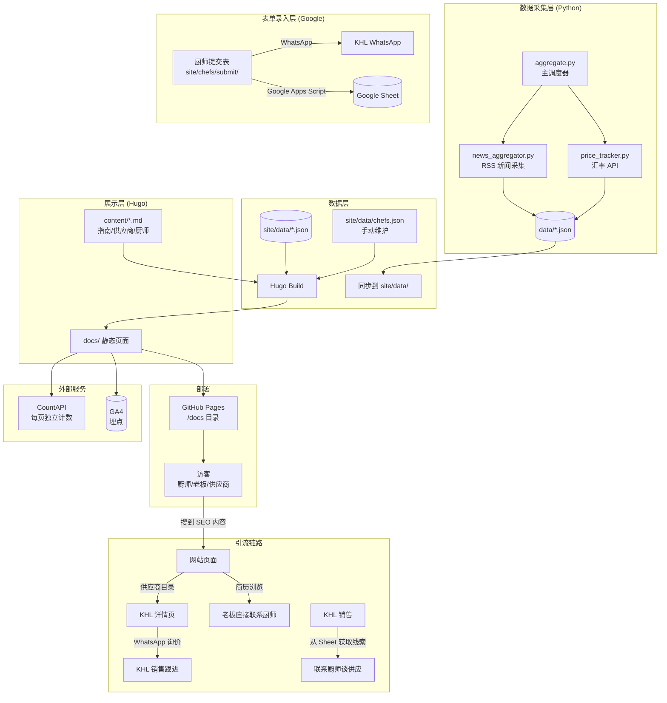

# ARCHITECTURE.md

> **开发信条：** 厨师简历栏 = 免费招聘栏位 → 吸引厨师注册 → 拿到线索 → KHL 销售谈供应。
> KHL 不介入安排厨师工作，不做中介。所有开发决策以此为准。

## 系统拓扑



## 数据流向

```
RSS 源 / 汇率 API
    ↓ (手动构建)
Python 采集 → data/*.json
    ↓
site/data/*.json → Hugo 读取
    ↓
手动 Hugo 构建 → docs/ 输出
    ↓
git push → GitHub Pages

厨师表单:
网站提交 → WhatsApp 通知老板
        → Google Sheet 记录存档
```

## 页面计数

```
每个页面加载时:
CountAPI hit → 存到云端计数器
Dashboard 读取: CountAPI get → 按流量排序展示
GA4: 标准 page_view 事件（需替换真实 Measurement ID）
```

## 模块依赖

```
aggregate.py  ← 依赖 ← news_aggregator.py
aggregate.py  ← 依赖 ← price_tracker.py
Hugo layouts   ← 读取 ← site/data/*.json（运行时）
Hugo layouts   ← 读取 ← site/data/chefs.json（手动维护）
无循环依赖。所有数据单向流动。
```
